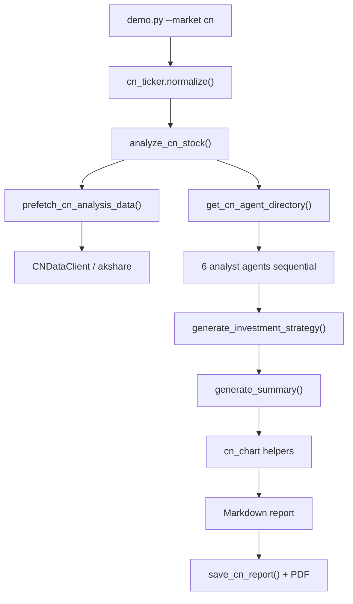

# CN A-Share Report Generation — Design Spec

**Date:** 2026-06-06  
**Status:** Approved  
**Scope:** Report generation only (v1)

---

## 1. Goals & Scope

### Goal

Generate full-parity A-share analysis reports (6 analyst sections + investment strategist + executive summary + PDF) for Shanghai and Shenzhen listed stocks, invokable from the existing demo CLI.

### In Scope (v1)

- `python -m prism.ops.dev.demo 600519 --market cn --language zh`
- Bare 6-digit tickers; auto-detect exchange from prefix
- [akshare](https://github.com/akfamily/akshare) as the primary data source
- Configurable report language per run (`en`, `zh`, and others via `LANGUAGE_NAMES`)
- Markdown + PDF output under `var/reports/` and `var/pdf_reports/`
- Optional news via Perplexity (same gate as US — skip if no API key)

### Out of Scope (v1)

- CN trigger batch / surge detection
- CN trading / KIS integration
- CN macro intelligence pipeline (orchestrator step)
- Scheduled batch orchestrator for CN
- Social sentiment (US-only Adanos client)

### Success Criteria

- Demo completes for at least one SH ticker (e.g. `600519`) and one SZ ticker (e.g. `000001`)
- Report contains all 8 logical sections (6 analysts + investment strategy + executive summary)
- PDF renders readable Simplified Chinese when `--language zh`
- US demo behavior unchanged (`python -m prism.ops.dev.demo AAPL`)

---

## 2. Approach

### Selected: Parallel CN Module (Approach 1)

Mirror the US layout with a dedicated CN stack:

```
CNDataClient (akshare) → prefetch_cn_analysis_data → CN agent factories → analyze_cn_stock()
```

The demo dispatches on `--market cn` vs default `us`.

**Rationale:** Isolates CN logic from the working US pipeline, matches existing repo patterns (`analyze_us_stock`, `USDataClient`, `get_agent_directory`), and keeps v1 risk low.

### Rejected Alternatives

| Approach | Why not v1 |
|----------|------------|
| Unified `analyze_stock(market=...)` | Larger refactor; risk to US path |
| Patch US agents with akshare | US assumptions (USD, SEC, S&P 500) leak into CN reports |

---

## 3. Architecture



### New Modules

| Module | Purpose |
|--------|---------|
| `src/prism/core/market/cn_ticker.py` | Validate 6-digit code; infer `SH`/`SZ`; build akshare symbols |
| `src/prism/core/data/cn_client.py` | Thin akshare wrapper: OHLCV, info, financials, holders, indices |
| `src/prism/core/data/cn_prefetch.py` | `prefetch_cn_analysis_data(code)` → markdown blobs for agent injection |
| `src/prism/core/market_calendar_cn.py` | Last CN trading day (SSE/SZSE shared holiday calendar) |
| `src/prism/core/analysis_cn.py` | `analyze_cn_stock()` — mirrors `analyze_us_stock()` hybrid execution |
| `src/prism/core/agents/cn/` | CN agent factories (6 agents, CN prompts & metrics) |
| `src/prism/core/agents/cn_directory.py` | `get_cn_agent_directory()` |
| `src/prism/core/visualization/cn_chart.py` | Price / technical / holder charts from akshare DataFrames |
| `src/prism/reporting/report_generator.py` | Add `save_cn_report()` / `save_cn_pdf_report()` |

### Reused (Shared Synthesis)

- `generate_report()`, `generate_market_report()`, `generate_investment_strategy()`, `generate_summary()` from `report_generation.py`
- `MCPApp` + Perplexity for `news_analysis` when `PERPLEXITY_API_KEY` is set
- PDF pipeline via `markdown_to_pdf()` (with font stack update for CJK)

### CN Agent Adaptations

| US Section | CN Equivalent |
|------------|---------------|
| Price & volume | akshare OHLCV; CNY; SH/SZ session context |
| Institutional holdings | 十大股东 + 基金持仓 + 北向资金 (沪深港通) where akshare provides it |
| Company status | PER/PBR/ROE, financial statements (CNY), analyst consensus if available |
| Company overview | Business model, competitors, segment revenue |
| News | Perplexity; query uses Chinese company name + A-share context |
| Market index | 上证指数, 深证成指, 创业板指, 沪深300 (prefetched OHLCV) |

---

## 4. Ticker & Exchange Rules

### Input

Bare 6-digit string: `600519`, `000001`, `300750`.

### Normalization (`cn_ticker.normalize`)

| Prefix pattern | Exchange | akshare symbol | Notes |
|----------------|----------|----------------|-------|
| `60` | Shanghai (SH) | `sh600519` | Main board A-share |
| `68` | Shanghai (SH) | `sh688981` | STAR Market (科创板) |
| `00` | Shenzhen (SZ) | `sz000001` | Main board A-share |
| `30` | Shenzhen (SZ) | `sz300750` | ChiNext (创业板) |

B-share codes (e.g. `90xxxx`) are **not supported** in v1.

### Validation

Reject with clear CLI errors:

- Non-6-digit or non-numeric input
- Unknown prefix (e.g. `500001`)

### Company Name Lookup

akshare `stock_individual_info_em` (or equivalent) when `--market cn` and no name argument provided. User override remains supported:

```bash
python -m prism.ops.dev.demo 600519 "贵州茅台" --market cn --language zh
```

### Reference Date

`get_cn_reference_date()` returns the last SSE/SZSE trading day (mainland exchanges share the same holiday calendar).

---

## 5. Data Layer (akshare)

### CNDataClient Methods

| Method | akshare source (indicative) | Used by |
|--------|----------------------------|---------|
| `get_ohlcv(symbol, period)` | `stock_zh_a_hist` | price_volume, charts |
| `get_stock_info(symbol)` | `stock_individual_info_em` | company_status, overview |
| `get_financial_indicators(symbol)` | `stock_financial_analysis_indicator` | company_status |
| `get_financial_statements(symbol)` | `stock_financial_report_sina` / balance sheet APIs | company_status |
| `get_top_holders(symbol)` | `stock_gdfx_top_10_em` | institutional |
| `get_fund_holdings(symbol)` | `stock_fund_hold_em` | institutional |
| `get_northbound_flow(symbol)` | `stock_hsgt_individual_em` | institutional |
| `get_index_ohlcv(index_code)` | `stock_zh_index_daily_em` | market_index |

### Prefetch Bundle Keys

Mirror US shape where possible:

- `stock_ohlcv`
- `stock_info`
- `holder_info`
- `financial_statements`
- `market_indices`
- `company_profile`
- `segment_revenue` (if available)

### Rate Limiting

Sequential section execution with 2–3 second delay between akshare-backed sections (same pattern as US yfinance path). akshare is scrape-based — no API key, but request pacing is required.

### Dependency

Add `akshare>=1.14` to `requirements.txt`.

### Error Handling

| Failure | Behavior |
|---------|----------|
| akshare OHLCV empty | Abort: `"No price data for {code} — market may be closed or code invalid"` |
| Partial prefetch (e.g. northbound flow) | Log warning; agent proceeds with available data |
| akshare network/rate error | Retry once per prefetch call; degrade or abort for critical data |

---

## 6. CLI & Demo Changes

Extend `src/prism/ops/dev/demo.py` without breaking US defaults.

### Examples

```bash
python -m prism.ops.dev.demo 600519 --market cn --language zh
python -m prism.ops.dev.demo AAPL                              # unchanged (US default)
python -m prism.ops.dev.demo 600519 "贵州茅台" --market cn -l zh
```

### Arguments

| Argument | Default | Behavior |
|----------|---------|----------|
| `ticker` | `AAPL` | US: uppercase symbol; CN: 6-digit code |
| `--market` | `us` | `us` \| `cn` |
| `--language` / `-l` | `en` | Forwarded to `analyze_*_stock()` |
| `company_name` | auto | US: yfinance; CN: akshare lookup |

### Routing

```python
if market == "cn":
    code, exchange = cn_ticker.normalize(ticker)
    report = await analyze_cn_stock(code, company_name, ..., language=language)
    save_cn_report(...)
else:
    report = await analyze_us_stock(...)
    save_us_report(...)
```

### CLI Validation

- `--market cn` + non-6-digit ticker → error with usage hint
- Unknown A-share prefix → error listing valid prefixes

---

## 7. Report Assembly, Language & PDF

### Report Structure

1. Header (company name, code, date, exchange SH/SZ)
2. Executive summary
3. Analyst sections (1-1, 1-2, 2, 3, 4, 5)
4. Investment strategy
5. Disclaimer (CN regulatory wording when `language=zh`)

### Language

- Add `"zh": "Chinese"` to `LANGUAGE_NAMES` in `report_generation.py` (and `"ko": "Korean"` if still missing).
- CN agent prompts: English markdown heading structure (`###` / `####`), localized body prose per `--language`.
- Currency: CNY (人民币) in all price and valuation references.

### PDF / CJK Rendering

Extend `DEFAULT_CSS` in `pdf_converter.py`:

```css
font-family: "Pretendard", -apple-system, "Noto Sans SC", "Noto Sans CJK SC", "PingFang SC", sans-serif;
```

- macOS: system CJK fonts via Chromium/Playwright
- Linux: document `fonts-noto-cjk` requirement in `docs/setup.md`

### Output Paths

Same directories as US:

- `var/reports/{code}_{company}_{date}_analysis.md`
- `var/pdf_reports/{code}_{company}_{date}_analysis.pdf`

---

## 8. Execution Flow

### Hybrid Mode (mirrors US)

**Sequential (akshare, 2–3s delay):**

1. `price_volume_analysis`
2. `institutional_holdings_analysis`
3. `company_status`
4. `company_overview`
5. `market_index_analysis` (cached per run via `_cn_market_analysis_cache`)

**Parallel (separate MCPApp):**

- `news_analysis` if `PERPLEXITY_API_KEY` is set; otherwise placeholder text

**Post-sections:**

- `investment_strategy` → `summary` → charts → compile markdown

### MCP Servers for CN

No `yahoo_finance` MCP for CN. Agents receive prefetched data; Perplexity (+ `time`) used only where needed.

### Remaining Error Handling

| Failure | Behavior |
|---------|----------|
| Perplexity missing | Skip news; US-style placeholder |
| Agent section error | `"Analysis failed: {section}"`; continue |
| PDF conversion failure | Return markdown path; surface error |

---

## 9. Testing & Verification

### Unit Tests — `tests/test_cn_ticker.py`

- `600519` → SH / `sh600519`
- `000001` → SZ / `sz000001`
- `300750` → SZ (ChiNext)
- Invalid: `12345`, `abc123`, `500001` → raises

### Integration Tests — `tests/test_cn_analysis.py`

- Mock `CNDataClient` / akshare (no live network in CI)
- Assert `prefetch_cn_analysis_data` returns expected keys
- Assert `get_cn_agent_directory` builds all 6 agents

### Manual Smoke Test

```bash
pip install -e .
python -m prism.ops.dev.demo 600519 --market cn --language zh
python -m prism.ops.dev.demo 000001 --market cn --language en
python -m prism.ops.dev.demo AAPL   # US regression
```

### CI Policy

Live akshare calls are not required in CI (flaky, geo-dependent). Optional `@pytest.mark.network` tests may be added later.

---

## 10. Implementation Checklist (high level)

1. Add `akshare` dependency
2. Implement `cn_ticker`, `CNDataClient`, `cn_prefetch`, `market_calendar_cn`
3. Implement CN agents + `cn_directory`
4. Implement `analyze_cn_stock` + `cn_chart`
5. Extend demo CLI (`--market cn`)
6. Add `save_cn_report` / PDF font fix
7. Add unit + mocked integration tests
8. Manual smoke on SH + SZ tickers

---

## 11. Open Items (none for v1)

All v1 decisions are resolved. Trading, batch orchestration, and CN macro intelligence are explicitly deferred.
